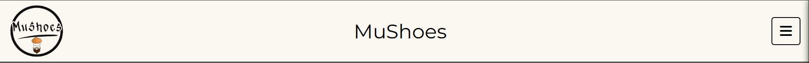
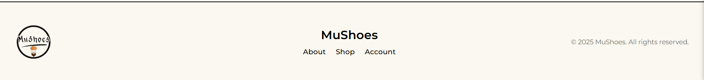

# Frontend

Documentation of General Frontend practices. Additionally specific page by page documentaion included as well.

## Folder Architecutre
- Folder is called public_frontend
```
> MUSHOES-ONLINE-STORE
  > .vscode
  > images
  > node_quickstart
    > documentation
    > models
    > mongodb-mongoose
    > node_modules
    > public_frontend
      > admin
        - admin-dashboard-munhak.html
        - test-all-listing-checkout.html
      > scripts
      > styles
      - about.html
      - account.html
      - cancel.html
      - customer-account.html
      - header-footer.html
      - index.html
      - product.html
      - shop.html
      - success.html
    > temp_image_uploads
    - .env
    - cloudinary-connection.js
    - db-connection.js
    - expressServer.js
    - index.js
    - mongo_db_express_queries.js
    - old-index.js
    - package-lock.json
    - package.json
    - schema-connection.js
    - seed.js
    - testUpload.js
```


## Overview

Frontend was built on top of the backend, supporting/allowing the key operations that can take place. The approach taken to build the frontend was functionality of backend and simplicity.

### Frontend Division

Frontend is split into two different parts: Customer Facing Frontend and Client Facing Frontend.

- [See Customer-Side Functionality Here](Overview.md#customer-uses)

Customer facing any indivudal can access. Client facing is locked behind express-basic-auth. 

- [See Client-Side Functionality Here](Overview.md#client-uses)


### Frontend Development Practices

All Frontend pages at their root consist of a header and footer. This header and footer allow for navigation to different pages. (Pictured Below)

Header


Footer


Between the header and the footer is where all the content of the page goes

``` html
<body>

  <div class="header"></div>

  <!-- All Page Specific Content Goes Here -->

  <div class="footer"></div>

</body>
```

Furthermore each page also includes these basics:

1. Styles for Header and Footer in HTML Head
``` html
<!-- Page Head -->
<link rel="stylesheet" href="styles/header-footer.css">
```

2. Cloudinary Import 
``` html
<!-- Page Head -->
<link rel="stylesheet" href="https://cdnjs.cloudflare.com/ajax/libs/font-awesome/6.0.0-beta3/css/all.min.css">
```

3. Imported Fonts from Google Fonts
``` html
<!-- Imported Fonts -->
<link rel="preconnect" href="https://fonts.googleapis.com">
<link rel="preconnect" href="https://fonts.gstatic.com" crossorigin>
<link href="https://fonts.googleapis.com/css2?family=Montserrat:ital,wght@0,100..900;1,100..900&display=swap" rel="stylesheet">
```

4. Hamburger Menu Functionality JavaScript inside HTML Body
``` html
<!-- Page Body -->
<script src="/scripts/hamburger-menu.js"></script>
```
See [hamburger-menu.js] documentation here

## 1. Index.html

This is the first page shown when visiting MuShoes.

### Index.html Architecure

``` html
<html>
  <head>

  </head>

  <body>
    <div class="header"></div>

    <!-- Hero Section: -->
     <!-- Centerpiece Image accompanied with About Us button redirecting to About.html page -->

    <div class="footer"></div>
  </body>
</html>
```

### Index.html Functionalities
1. Navigation to different .html pages using Header and Footer
2. Navigation to About.html when clicking "About Us" button


### Related Files

1. index.css - Styling for Centerpiece
   ``` html
   <link rel="stylesheet" href="styles/index.css">
   ```

### Code Documentation / Decision Making

Simple Code no need to document here

## 2. About.html

### About.html Architecture

``` html
<html>
  <head>

  </head>

  <body>
    <div class="header"></div>

    <section class="about-hero"></section>
    <section class="service-section"></section>
    <section class="vision-section"></section>
    <section class="contact-section"></section>

    <div class="footer"></div>
  </body>
</html>
```

### About.html Functionalities

1. Navigation to different .html pages using Header and Footer.
2. Toggling/Untoggling of Accordion Blocks to see brand specific information.
3. Contact Form allowing Customers to reach out to Client (Contact Form currently does not send or save data anywhere).

### Related Files
1. About.css
2. About.js
   - Contains documented code for Accordion Block and Contact Form functionality.

### Code Documentation / Decision Making

#### Services-Section

Accordion Block to showcase Brand Specific info

#### Contact-Section

Basic Contact Form

NOTE: Contact Form currently able to do everything besides send or save data somewhere.


## 3. Shop.html

### Shop.html Architecture

``` html
<html>
  <head>

  </head>

  <body>
    <div class="header"></div>

    <div class="shop-rows products-grid"></div>

    <div class="footer"></div>
  </body>
</html>
```

### Shop.html Functionalaties

1. Navigation to different .html pages using Header and Footer.
2. Pulls data from database, generates HTML, and displays all currently available shoe listings
3. Allowing clicking on a listing redirecting to Product.html which shows additinal details regarding the shoe


### Related Files

1. Shop.css
2. Shop.js
   - Containts JavaScript neccesary for frontend -> backend -> database connection

### Code Documentation / Decision Making

- Shop.html in itself is a simple page. It contains only the header, footer, and empty div which has shop-rows and products-grid used by JavaScript to store generated HTML
  


Shop.js

#### fetchListingsFromMongoDB
- Asynchronous function communcating with the backend
- Sends a GET request to /fetch_all_listings endpoint
- Backend queries all listings by calling [readAllListings](Backend.md#mongo_db_express_queries.js) helper function from [mongo_db_express_queries.js](Backend.md#mongo_db_express_queries.js), storing all data returned from call and parsing to /fetch_all_listings endpoint
- Lastly, fetchListingsFromMongoDB takes the data and parses to showcaseListings() function

#### showcaseListings(listings)
- Method which takes the parsed in data and uses it to generate the html
- Method then takes generated html and sets it to the div with the class .products-grid
- Lastly, showcaseListings(listings) calls openListingFunctionality()

#### openListingFunctionality()
- Adds click event handler to each listing "card"
- On click takes redirects to Product.html and sends the id into the url as well

``` JavaScript
window.location.href = `product.html?id=${id}`;
```


### Future Enhancements
- Currently nothing in backend or frontend to prevent displaying listings which have 0 or negative stock. So need to implement that. Should be acheived through a simple if statement in maybe the JavaScript preventing display. I'd rather not do it in the [readAllListings](Backend.md#mongo_db_express_queries.js) since it's shared by other functions


## Product.html

### Execution Flow Overview

1. Page finishes loading
2. Product ID is extracted from the URL
3. Backend is queried for that product’s data
4. Product details are rendered dynamically
5. User clicks Buy Now
6. Stripe Checkout session is created and user is redirected

### Product.html Architecture

``` html
<html>
  <head>

  </head>

  <body>
    <div class="header"></div>

    <div class="product-page"></div>

    <div class="footer"></div>
  </body>
</html>
```

### Product.html Functionalities

1. Navigation to different .html pages using Header and Footer.
2. Scrolling through various product images of the specific listing
3. Allowing the ability to buy a shoe by clicking the "Buy Now" button, which redirects page to Stripe Checkout Sandbox


### Related Files

1. products.css
2. product.js


### Code Documentation / Decision Making

- Product.html is intentionally minimal and contains only structural elements.
- All product-specific data and UI are rendered dynamically using `product.js`.
- This approach allows a single Product.html page to be reused for all listings.
- Business logic (pricing, stock validation, checkout) is handled by the backend to ensure data integrity.


- Page waits until fully loaded, then calls getProductID()
- A click event listener is attached using event delegation to handle the dynamically generated Buy Now button 

#### getProuctId fucntion
- Extracts the product ID from the URL query string
- Calls getProductDetails(mongoID) and passes in the extracted ID

#### getProductDetails(mongoID) function

- Asynchronous function communicating with the backend
- Sends a POST request to the /product endpoint with the MongoDB ID
- Backend receives the ID and calls
findAListing(mongoID)
- If a matching listing is found, the backend returns the product data
- The product data is passed to displayProductDetails(productDetails)

#### displayProductDetails(productDetails)

- Dynamically generates all product-related HTML content
- Renders:
  - Multiple product images (Cloudinary or full URLs)
  - Brand, name, size, condition, and description
  - Buy Now button with price
- Disables the Buy Now button if product quantity is <= 0
- Injects generated HTML into the .product-page container

#### buyNow(productID)

- Called when the Buy Now button is clicked
- Asynchronous function communicating with the backend
- Sends a POST request to the /create-checkout-session endpoint
- Backend:
  - Retrieves the product using findAListing(mongoID)
  - Checks product quantity
  - If quantity is <= 0, returns an insufficient quantity response
  - If valid, creates a Stripe Checkout session
  - Sends the Stripe redirect URL back to the frontend
- buyNow() pauses execution until a response is received, then either:
  - Displays an error message
  - Redirects the user to Stripe Checkout


### Future Enhancements

- Add client-side handling for missing or invalid product IDs

### Key Notes

- A Stripe checkout session will never be created if the product quantity is <= 0
- Backend validation ensures stock integrity regardless of frontend state


## Account.html

### Execution Flow Overview

1. Account page loads and initializes header/footer scripts
2. Login and register form event listeners are attached on window load
3. User switches between Login and Register tabs
4. User submits login form
5. Frontend sends credentials to `/admin-login`
6. Backend validates credentials and returns redirect URL
7. Frontend redirects user based on backend response


### Account.html Architecture

``` html
<html>
  <head>

  </head>

  <body>
    <div class="header"></div>

    <main class="account-main">
      <div class="auth-container">

        <div class="auth-tabs"></div>

        <div id="loginForm"></div>

        <div id="registerForm"></div>

      </div>

      <div class="confirmation-container"></div>  

      </div>

    </main>

    <div class="footer"></div>
  </body>
</html>
```

### Account.html Functionalities

1. Navigation to different .html pages using Header and Footer.
2. Allowing Client to log in to Admin Dashboard

### Related Files

- account.css
- account.js

### Code Documentation / Decision Making

#### On Window Load Function
- JavaScript checks whether loginFormElement and registerFormElement exist on frontend. If they do, then they add submit event listeners which run handleLogin() and handleRegister() functions. 

#### switchTab(tab) function
- grabs loginTab, loginForm, registerTab, and registerForm id's from DOM.
- Simple if-else branch checking 
  ``` JavaScript
  if (tab === 'login') {
    // add class 'active' to all login related classes
    // remove class 'active' from all non login related classes
  }
  else if (tab === 'register') {
    // add class 'active' to all register related classes
    // remove class 'active' from all non register related classes
  }
  ```
- Calls clearErrorMessages() function

#### async function handleLogin(e)

- Prevents page refreshing and calls clearErrorMessages() function
- JavaScript grabs username and password from DOM id's. Then performs error checking.
  - Error checking is simple. Only checking for non null values
- Sends a POST request to the /admin-login endpoint with the username and password
- Backend receives the username and password from the endpoint, and checks those values against the ADMIN_USER and ADMIN_PASS enviornment variables.
  ``` JavaScript
  if (username === process.env.ADMIN_USER &&
        password === process.env.ADMIN_PASS) {
          // return /admin/admin-dashboard-munhak.html
        }
  ```
  - If user entered username and password match the enviorment variables, then backend responds with url to admin dashboard
  - if credentials don't match, then backend always returns default customer-account.html url
- One frontend receives endpoint response, it checks if response ok and url exists, then redirects to url acquired from response
- returns true

#### function handleRegister(e)

- Prevents page refreshing and calls clearErrorMessages() function
- Grabs register_username, register_email, register_password, register_confirm_password from DOM using id's.
- Performs error checking
  - Ensures username is not null and length is at least 3
  - Ensures email is not null and follows email format
  - Ensures password is not null, is at least 6 characters long, and matches confrim password
  - Console logs all the data. (In running application which has working registration form, this data wouldn't be logged but sent to the backend instead)
- calls showConfirmation(username) function parsing in the username
- returns true

#### function showConfirmation(username)
- Show confirmation page after successful registration
- Grabs authContainer, confirmationContainer, and confirmedUsername from DOM using id's
- Sets authContainer display to 'none', confirmationContainer display to 'block', and then finally sets confirmedUsername to the parsed in user

#### function backToLogin()

- Used inside registraion confirmation modal
- Grabs authContainer and confirmationContainer from DOM using id's
- Sets authContainer display to 'block' and confirmationContainer display to 'none'
- Calls switchTab('login') and defauls to login form while also restting registration form

#### function showError(formType, message)
- Displays error messages at the top of the forms
- Uses parsed in formType variable to determine whether error message is to be displayed on loginForm or registrationForm
- Checks whether the error already exists. If not, then create the error message and display at the top of the form

#### function clearErrorMessages()
- Selects all elements with class error-message from DOM and then iterates through removing them all

### Future Enhancements

- Implement backend-powered user registration and persistence.
- Replace environment-variable authentication with database-backed users
- Add proper password hashing and session-based authentication.
- Improve validation and error handling for login and registration.
- Add loading states and prevent multiple form submissions.

### Key Notes

- Login functionality is admin-only and validates credentials against backend environment variables.
- Only one admin user is supported at this time.
- Registration form is frontend-only and does not persist user data.
  - Will be removing this registration form for now as well as formTab for initial deployment. Should also be able to remove confirmation container as well.
- Native browser validation is used for basic required field checks, with additional custom JavaScript validation and error handling applied after submission.
- Frontend trusts the backend redirect URL after successful login.
- Account page requires JavaScript to function correctly.


## admin-dashboard-munhak.html

### Execution Flow Overview

1. Admin successfully authenticates via /admin-login endpoint
2. Admin is redirected to admin-dashboard-munhak.html
3. Page loads and initializes header, footer, and admin dashboard scripts
4. Admin selects an operation from the dropdown:
   1. Upload Listing
   2. Delete Listing
5. Based on selection:
   1. Upload form is displayed and submission handled
   2. OR existing listings are fetched and rendered for deletion
6. Confirmation modals are used for success and delete confirmation
7. Backend routes handle persistence and deletion in MongoDB

### Admin-Dashboard-Munhak.html Architecture

``` html
<html>
  <head>

  </head>

  <body>
    <div class="header"></div>

    <main class="admin-main-content">
      
      <div class="admin-dashboard-header"></div>

      <div id="admin_operations"></div>  

      <div id="upload_listing"></div>

      <div id="delete_listing"></div>

    </main>

    <div class="footer"></div>

    <div id="confirmationModal"></div>
  </body>
</html>
```

### Admin-Dashboard-Munhak.html Functionalities

1. Navigation to different .html pages using Header and Footer
2. Upload new shoe listings to MongoDB
3. View all existing listings
4. Delete listings from MongoDB
5. Confirmation modals for upload success and deletion
6. Image upload and preview using Cloudinary-hosted images

### Related Files

1. admin-listings.css
2. admin-all-listings.css
3. admin-dashboard-scripts.js

### Code Documentation / Decision Making

#### On window load function

- Adds a change event listener to the admin operation dropdown
- Toggles visibility of:
  - upload_listing
  - delete_listing
- When Delete Listing is selected:
  - Calls viewAllListings() to fetch listings from the backend
- Adds:
  - Submit button click listener
  - Modal close handlers
  - Click-outside modal detection

#### Async function SubmitListing(e)

- Disables submit button to prevent duplicate submissions
- Prevents page reload
- Calls formValidation() before proceeding
- Collects all form values into a shoeData object
- Converts listing data into FormData
- Required so images can be processed via multer, so that url may be uploaded to Cloundinary later
- Sorts uploaded images alphabetically
- Sends POST request to /admin/dashboard/upload_listing
- Backend Behavior:
  - Parses listing JSON
  - Sorts images
  - Stores image paths
  - Saves listing in MongoDB using Shoe schema
- Frontend On Success of Backend:
  - Displays success confirmation modal
  - Clears upload form
  - Re-enables submit button

#### formValidation()

- Performs frontend validation before upload:
  - Ensures required fields are not empty
  - Validates:
    - Shoe size (positive number)
    - Gender (M or F)
    - Price (>= 0, in cents)
    - Stock (minimum of 1)
- Displays styled error message if validation fails

#### async function viewAllListings()

- Sends GET request to /admin/dashboard/view_deletable_listings
- Backend calls and retrieves all listings using readAllListings().
- Backend returns data to frontend where all listings are passed to showCaseListings(listings) function.

#### function showcaseListings(listings)

- Dynamically generates HTML for each listing
- Displays:
  - Image (Cloudinary or placeholder)
  - Brand, name, price
  - Size, gender, condition, stock
- Injects listings into .products-grid
- Calls listingDeletionFunctionality() after render

#### function listingDeletionFunctionality()

- Adds click handlers to all rendered listings
- On click:
  - Extracts listing details from DOM
  - Opens delete confirmation modal
  - Passes listing metadata into modal

#### function deleteListingRequest(mongoID)

- Sends POST request to /admin/dashboard/delete_listing
- Backend deletes listing using deletAListing(mongoID)
- MongoDB entry is permanently removed

#### Delete Confirmation Flow

1. Admin clicks listing
2. Delete confirmation modal appears
3. Admin clicks Delete
4. confirmDelete() is called
5. Backend deletion request is sent
6. Success modal is displayed
7. Listings refresh automatically

#### Confirmation Modal System

- Single modal reused for:
  - Upload success
  - Delete confirmation
  - Delete success
- Modal dynamically updates:
  - Icon
  - Title
  - Body content
  - Footer buttons
- Clicking outside modal or close button exits modal

### Future Enhancements

- Add image handling deletion to Cloudinary when when listings are removed
- Insteda of permenantly deleting listings, send them to a recnetly deleted folder in MongoDB, in case client needs records later

### Key Notes

- Admin dashboard is protected using express-basic-auth
- Only authenticated admins can access /admin/* routes
- All listing creation and deletion is validated on the backend
- Images are processed using multer before being stored
- Frontend prevents invalid submissions but backend remains the source of truth
- Confirmation modals are reused for consistency and UX clarity