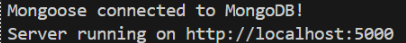

# Overview

General Information on MuShoes

## Purpose

Web application was created for many reasons. Put simply these reasons include the client being able to sell their retail and custom sneakers online as well as well as displaying their past and current works for new customers to see.

## Use Cases/Features

MuShoes web application consists of many user cases/features which can be split into two general categories. 

### Customer Uses

1. Customers can contact Client (MuShoes) using contact form
2. Customers can browse shoe listings
3. Customers can purchase shoe listings

### Client Uses

1. Client can do everything that Customers can
2. Client can log in into MuShoes
   1. Client can upload a shoe listing which will update the database and add to list of show listings IF valid
   2. Client can delete a shoe listing which will delete the listing from the database and update shoe listings IF valid

## Tech Stack

### Frotend

1. HTML
2. CSS
3. JS
4. React.js?

### Backend

1. Node.js
2. Express.js
   - To allow REST API Endpoints

### Database

1. MongoDB
   - To store all shoe listings. Will eventually include customer data as well

### External API's

1. Stripe API
   - To Process all orders
2. Cloudinary API
   - To host images allowing application to showcase images


## How to Run

1. First open MuShoes project folder inside Microsoft Visual Studio Code 
2. Open terminal and type the following commands to install the following dependencies: 

``` bash
cd mushoes-online-store/node_quickstart 
```
```
npm install cloudinary dotenv express express-basic-auth mongodb mongoose multer stripe
```

3. Npm install downloads the following dependencies: cloudinary, dotenv, express. express-basic-auth, mongodb, mongoose, multer, and stripe 

4. Ensure that your IP Address in MongoDB is live. (I have already enabled all ip addresses, this shouldn’t be an issue unless: Read instruction 5 and 6) 

5. Next, open terminal and run 

```
cd mushoes-online-store/node_quickstart 
```
```
node index.js 
```

6. Successful run of index.js should result in the terminal displaying a message similar to this:  


 

If the message above does not appear, than there is a connectivity issue with the database associated with ip addressing and the owner needs to be contacted. 

7. http://localhost:5000 is a clickable link provided by the terminal. Click the link to open the site. 